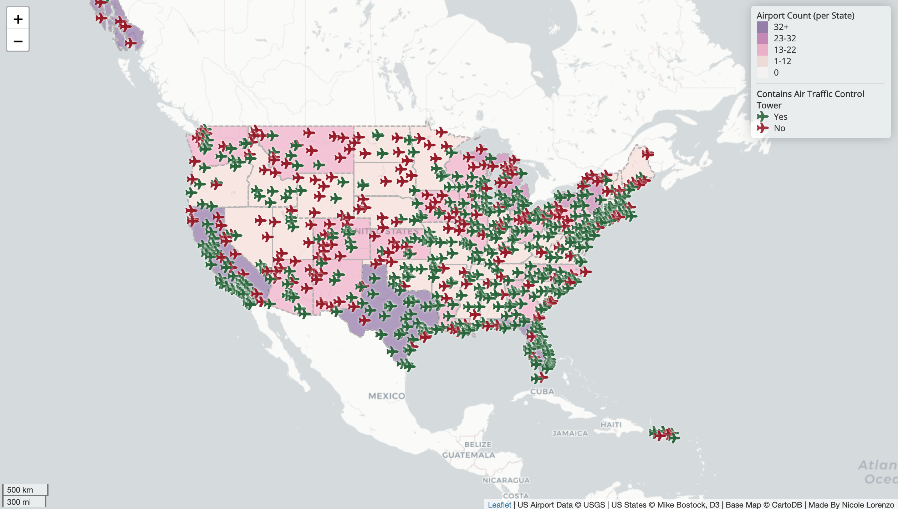

#Explore Airports Throughout the USA
<a href="https://nicolealorenzo.github.io/us_airport_explore/Index.html">Access the Interactive Map Here</a>

The map below highlights all of the airports in the United States. Each airplane icon on the map represents an airport. Green represents airports with air traffic control centers (most likely larger airports), and red represents smaller airports. The base layer is organized in a choropleth map representing the total number of airports within each state. The initial take away from the map highlights major airports in major cities. In relation to urban planning, this data could be used to represent accessibility to air transportation.

<i> Explore US Airports: Map </i>

###Notable Functions and Libraries
This lab focuses strongly on style abilities. The overall javascript and CSS style references that are added to the final index.html, are based on the latest version of Leaflet.The basemap design was obtained from CartoDB. In terms of the plane icons, I would acknowledge Font Awesome. The colors were set using Color Brewer and strategically setting ‘counts’ throughout the data. Chroma.js, the javascript library, was used to manipulate the colors. L.geoJson.ajax provided many functions (pointToLayer, style, onEachFeature) that contributed to creating the choropleth map and the plane icons. The legend was added by using Leaflet control. In terms of the legend and acknowledgments, it was styled using Google font library to standardize the font to Open Sans.

###Data Sources and Acknowledgments
<ul>
<li>Airport Data: Obtained from Data.gov 2017 Data</li>
<li>US State Data: Boundaries obtained from Mike Bostock of D3</li>
<li>Base Map: Tile Layer from CartoDB</li>
<li>Style Reference: Latest Version of Leaflet</li>
<li>Interactive map created by Nicole Lorenzo</li>
</ul>
